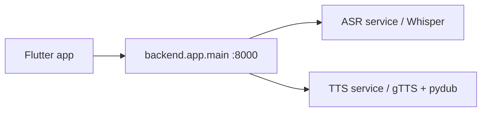

# Nsem Tech AI — Architecture

```
nsem-tech-ai/
├── backend/
│   ├── app/
│   │   ├── main.py           # Unified FastAPI app (port 8000)
│   │   ├── config.py         # Paths and environment settings
│   │   ├── routers/
│   │   │   ├── health.py     # GET /health
│   │   │   ├── asr.py        # POST /transcribe
│   │   │   └── tts.py        # POST /synthesize
│   │   └── services/
│   │       ├── asr_service.py
│   │       └── tts_service.py
│   ├── asr_engine/           # Training / offline scripts
│   └── tts_engine/           # Training / legacy modules
├── api/                      # Deprecated standalone apps (use backend.app.main)
├── frontend/mobile/          # Flutter client
├── datasets/
│   ├── metadata/             # Per-locale CSV corpora
│   ├── images/
│   └── raw/                  # Placeholder; raw audio via DVC/external storage
├── scripts/
│   ├── run_api.sh
│   └── generate_metadata.py
├── tests/
└── requirements.txt
```

## Request flow



## Run locally

```bash
./scripts/run_api.sh
cd frontend/mobile && flutter run --dart-define=API_BASE_URL=http://10.0.2.2:8000
```
